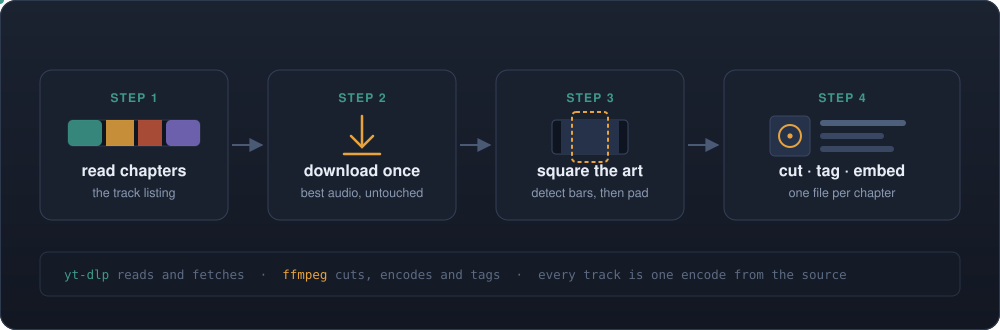
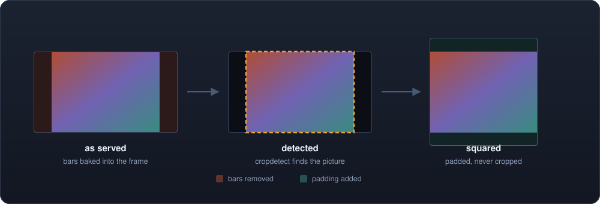

<div align="center">



<br>

[](https://github.com/alexnodeland/sleeve/actions/workflows/ci.yml)
[](https://github.com/alexnodeland/sleeve/releases)
[](#license)
[](#install)
[](#build-from-source)

**Full albums and concert recordings get posted as one long video with the track listing in the chapter markers.**
`sleeve` turns that back into an album.

```sh
sleeve https://youtu.be/VIDEO_ID
```

</div>

---

<table>
<tr>
<td width="50%" valign="top">

**What you start with**

One `.webm` file. Two hours long. A track listing that exists only as chapter markers, and artwork that exists only as a 16:9 thumbnail.

</td>
<td width="50%" valign="top">

**What you end with**

One tagged audio file per chapter, square cover art embedded in every one, filed in an album folder — and optionally already sitting in Apple Music.

</td>
</tr>
</table>

```
→ reading chapters

  Live at the Lantern Rooms
  Nightjar Quartet
  8 tracks · 1:04:12 · m4a

→ downloading audio
→ writing 8 tracks
   1. Copper Wire                                  6:41
   2. Marsh Light                                  9:03
   3. Slow Ascent                                  7:28
   …
   8. Undertow                                    11:16
```

That is the whole interface for the common case. Artist, album, and year are inferred from the video title and upload date — and every one of them can be overridden.

<br>

## Install

<table>
<tr>
<th width="20%">Method</th>
<th>Command</th>
</tr>
<tr>
<td><b>curl</b><br><sub>recommended</sub></td>
<td>

```sh
curl -fsSL https://raw.githubusercontent.com/alexnodeland/sleeve/main/install.sh | sh
```

</td>
</tr>
<tr>
<td><b>Cargo</b></td>
<td>

```sh
cargo install --git https://github.com/alexnodeland/sleeve
```

</td>
</tr>
<tr>
<td><b>Source</b></td>
<td>

```sh
git clone https://github.com/alexnodeland/sleeve && cd sleeve && cargo install --path .
```

</td>
</tr>
</table>

The install script detects your platform, verifies the published SHA-256 before
installing, and falls back to `~/.local/bin` when `/usr/local/bin` is not
writable — it never silently asks for `sudo`. Pin a version or change the
location with environment variables:

```sh
SLEEVE_VERSION=v0.1.0 SLEEVE_PREFIX=~/.local \
  curl -fsSL https://raw.githubusercontent.com/alexnodeland/sleeve/main/install.sh | sh
```

### Runtime dependencies

`sleeve` is a wrapper around two tools, and checks for both at startup rather
than failing after a long download:

```sh
brew install yt-dlp ffmpeg
```

<br>

## Features

| | |
|---|---|
| ✂️ **Chapter-accurate splitting** | One track per chapter, cut sample-accurately — no keyframe drift at the boundaries |
| 🏷️ **Complete tags** | Title, artist, album artist, album, date, genre, track *n/total*, disc, comment |
| 🖼️ **Cover art** | Thumbnail squared and embedded in every track — letterboxing detected and removed first |
| 🎧 **Three formats** | `m4a` (AAC), `mp3`, or `opus` — the last stream-copied from YouTube's own audio, never re-encoded |
| 🍎 **Apple Music** | `--music` hands the tracks to your library without needing an Automation permission |
| 📁 **Configurable** | Destination, format, bitrate and genre via flag, `SLEEVE_*` env var, or config file |
| 🔍 **Look first** | `--list` prints the track listing without downloading; `--dry-run` shows what would be written |
| 🧪 **Hermetic tests** | 93 tests, no network, no ffmpeg — the suite runs in under a second |

<br>

## How it works

<div align="center">

</div>

Three details are the difference between output that *looks* right and output
that **is** right. Each one is pinned by a test named after the failure it
prevents.

<table>
<tr>
<td width="33%" valign="top">

### One generation

Every track is cut from **a single download of the source audio**, not from an
intermediate file.

So each track is one encode away from the original rather than two.

</td>
<td width="33%" valign="top">

### No inherited chapters

Every track drops the source's chapter list with `-map_chapters -1`.

Without it, track 3 of an 8-track album carries all 8 markers and players
present it as the entire album — the durations look correct while the file
lies about what it is.

</td>
<td width="33%" valign="top">

### Padded, not cropped

Cover art is padded to square.

Padding costs background. Cropping costs the picture — and on a title card, it
crops the text.

</td>
</tr>
</table>

### Squaring the art

<div align="center">

</div>

Thumbnails are frequently *already* letterboxed — the uploader exported a 4:3 or
square graphic into a 16:9 frame — so the real image is a sub-rectangle of the
file. `sleeve` finds it with `cropdetect`, crops to it, and only then pads out
to a square.

<br>

## Usage

```sh
sleeve <URL> [OPTIONS]
```

<table>
<tr><th align="left">Flag</th><th align="left">Meaning</th></tr>
<tr><td><code>-d</code>, <code>--dest &lt;PATH&gt;</code></td><td>Where to write the album folder — default: your Desktop</td></tr>
<tr><td><code>-f</code>, <code>--format &lt;FMT&gt;</code></td><td><code>m4a</code> (default), <code>mp3</code>, or <code>opus</code></td></tr>
<tr><td><code>-b</code>, <code>--bitrate &lt;RATE&gt;</code></td><td>e.g. <code>256k</code> — default: 256k for m4a, 320k for mp3</td></tr>
<tr><td><code>--artist &lt;NAME&gt;</code></td><td>Override the inferred artist</td></tr>
<tr><td><code>--album &lt;TITLE&gt;</code></td><td>Override the inferred album</td></tr>
<tr><td><code>--year &lt;YEAR&gt;</code></td><td>Override the upload year</td></tr>
<tr><td><code>--genre &lt;GENRE&gt;</code></td><td>Genre tag</td></tr>
<tr><td><code>--comment &lt;TEXT&gt;</code></td><td>Comment written to every track</td></tr>
<tr><td><code>-m</code>, <code>--music</code></td><td>Also add the tracks to Apple Music (macOS)</td></tr>
<tr><td><code>--keep-full</code></td><td>Keep the un-split full-length audio too</td></tr>
<tr><td><code>--no-cover</code></td><td>Skip cover art</td></tr>
<tr><td><code>--flat</code></td><td>Write into the destination directly, no album subfolder</td></tr>
<tr><td><code>-n</code>, <code>--dry-run</code></td><td>Show what would be written, then stop</td></tr>
<tr><td><code>-l</code>, <code>--list</code></td><td>Print the track listing and exit — no download</td></tr>
</table>

Tracks land in an album folder named `Artist - Album`, with filenames like
`03 - Slow Ascent.m4a` — zero-padded to the width of the track count, so they
sort correctly everywhere.

### Formats

| | Codec | Cover art | Apple Music | Notes |
|---|---|---|---|---|
| **`m4a`** | AAC 256k | ✅ | ✅ | The default. Apple-native and widely played. |
| **`mp3`** | LAME 320k | ✅ | ✅ | Larger at equal quality; plays on everything ever made. |
| **`opus`** | *stream copy* | ❌ | ❌ | Not re-encoded at all when the source is already Opus. Art is written as `cover.jpg` beside the tracks. |

### Configuration

Settings resolve **flag → `SLEEVE_*` env var → config file → built-in default**.
The config file lives at `~/.config/sleeve/config.toml`:

```toml
dest         = "/Users/you/Music/Rips"
format       = "m4a"
bitrate      = "256k"
genre        = "Live"
add-to-music = true
keep-full    = false
```

Unknown keys are an error, not a silent no-op — a typo'd setting that does
nothing is indistinguishable from a setting that does not work.

### Apple Music

`--music` copies finished tracks into the folder Music watches for automatic
imports.

It deliberately does **not** use AppleScript. Scripting Music requires the
Automation entitlement, and when that has been denied the script *hangs* rather
than failing — with no one at the keyboard to dismiss the prompt, it simply
never returns. The watched folder needs no permission at all.

Tracks are **copied**, never moved, so your output directory still has them
afterward.

<br>

## Contributing

See [CONTRIBUTING.md](CONTRIBUTING.md). `just` lists the recipes; `just ci` runs
everything CI runs, in the same order.

```sh
just setup   # git hooks + tool check
just ci      # fmt · clippy · test · deny · doc · msrv
```

The test suite is **hermetic** — it never spawns yt-dlp or ffmpeg and never
touches the network. Everything that shells out is split into a pure
`*_args()` builder returning the argv and a thin runner, and the tests assert on
the argv. That is what makes the ffmpeg knowledge testable at all, and what
keeps the suite fast enough to run on every push.

<br>

## A note on what you rip

`sleeve` makes your own copies playable and organized. Whether a given video is
yours to download is between you, the uploader, and the rights holder.

Track titles and artwork come from the uploader's own chapter list and
thumbnail, so a rip is a personal-library artifact — not a released album, and
it will not match anything in a store.

<br>

## License

MIT **OR** Apache-2.0, at your option.
